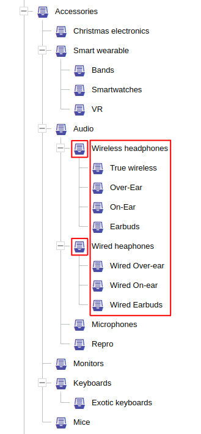

Hierarchy filtering can be applied only to entities [marked as hierarchical](../../use/data-model.md#hierarchy-placement) 
or to entities that [reference](../../use/data-model.md#references) these hierarchical entities. Hierarchy filtering 
allows filtering all direct or transitive children of a given hierarchy node, or entities that are directly or 
transitively related to the requested hierarchy node or its children. Filtering allows to exclude (hide) several parts 
of the tree from evaluation, which can be useful in situation when part of the store should be (temporarily) hidden 
from (some of) clients.

In addition to filtering, there are query [requirement extensions](../requirements/hierarchy.md) that allow you to 
compute data to help render (dynamic or static) menus that describe the hierarchy context you request in the query.

## Hierarchy within

The constraint <SourceClass>evita_query/src/main/java/io/evitadb/api/query/filter/HierarchyWithin.java</SourceClass> 
allows you to restrict the search to only those entities that are part of the hierarchy tree starting with the root 
node identified by the first argument of this constraint. In e-commerce systems the typical representative of 
a hierarchical entity is a *category*, which will be used in all of our examples. The examples in this chapter will
focus on the category *Accessories* in our [demo dataset](https://demo.evitadb.io) with following layout:


**Syntax:**

```evitaql
hierarchyWithin(
    filterConstraint,
    (directRelation|excluding|excludingRoot)*
)
```

<dl>
    <dt>filterConstraint</dt>
    <dd>
        a single filter constraint that identifies **one or more** hierarchy nodes that act as hierarchy roots; 
        multiple constraints must be enclosed in [AND](../logical.md#and) / [OR](../logical.md#or) containers
    </dd>
    <dt>(directRelation|excluding|excludingRoot)*</dt>
    <dd>
        optional constraints allow you to narrow the scope of the hierarchy; 
        none or all of the constraints may be present:
        <ul>
            <li>[directRelation](#direct-relation)</li>
            <li>[excluding](#excluding)</li>
            <li>[excludingRoot](#excluding-root)</li>
        </ul>
    </dd>
</dl>

### Self

The most straightforward usage is filtering the hierarchical entities themselves. 

To list all nested categories of *Accessories* category issue this query:

<SourceCodeTabs>
[Transitive category listing](docs/user/en/query/filtering/examples/hierarchy-within-self-simple.evitaql)
</SourceCodeTabs>

You should receive listing of these categories:

<MDInclude>[Single root hierarchy example](docs/user/en/query/filtering/examples/hierarchy-within-self-simple.md)</MDInclude>

The first argument specifies the filter targets the attributes of the `Category` entity. In this example we used
[attributeEquals](comparable.md#attribute-equals) for unique attribute `code`, but you can select the category
by localized `url` attribute (but then you need to provide also [entityLocaleEquals](locale.md#entity-locale-equals)
constraint for determining the proper language), or using [entityPrimaryKeyInSet](constant.md#entity-primary-key-in-set)
and passing category primary key. 

<Note type="info">

<NoteTitle toggles="true">

##### Can the parent node filter constraint match multiple ones? 
</NoteTitle>

Yes, it can. Although, it's apparently one of the edge cases, it's possible. This query:

<SourceCodeTabs>
[Multiple category listing](docs/user/en/query/filtering/examples/hierarchy-within-self-simple-multi.evitaql)
</SourceCodeTabs>

... will return all subcategories of the *Wireless headphones* and *Wired headphones* and their subcategories:

<MDInclude>[Multi-root hierarchy example](docs/user/en/query/filtering/examples/hierarchy-within-self-multi.md)</MDInclude>



</Note>

### Referenced entity

## Hierarchy within root
## Excluding
## Excluding root
## Direct relation