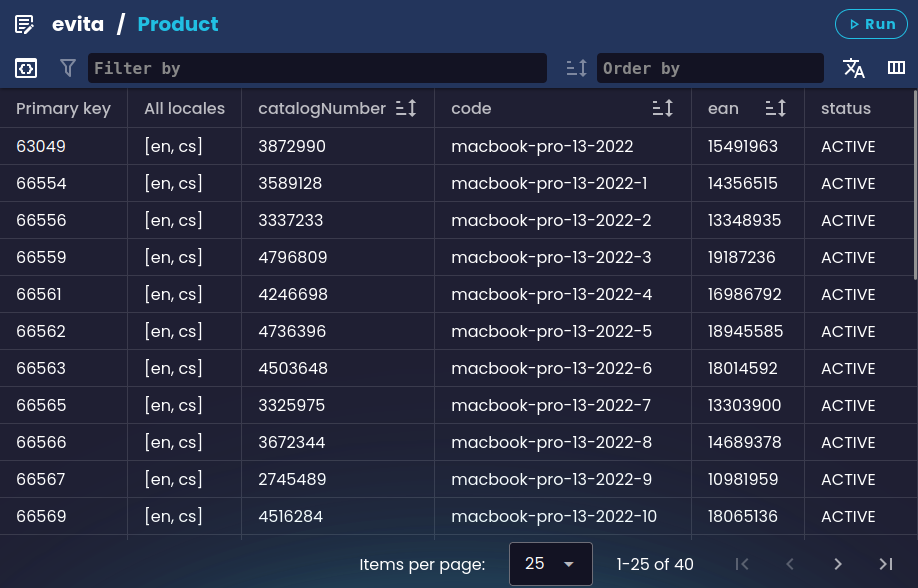
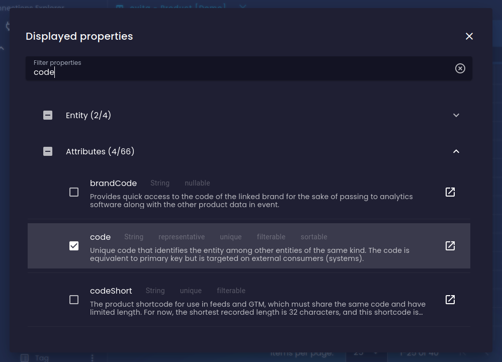
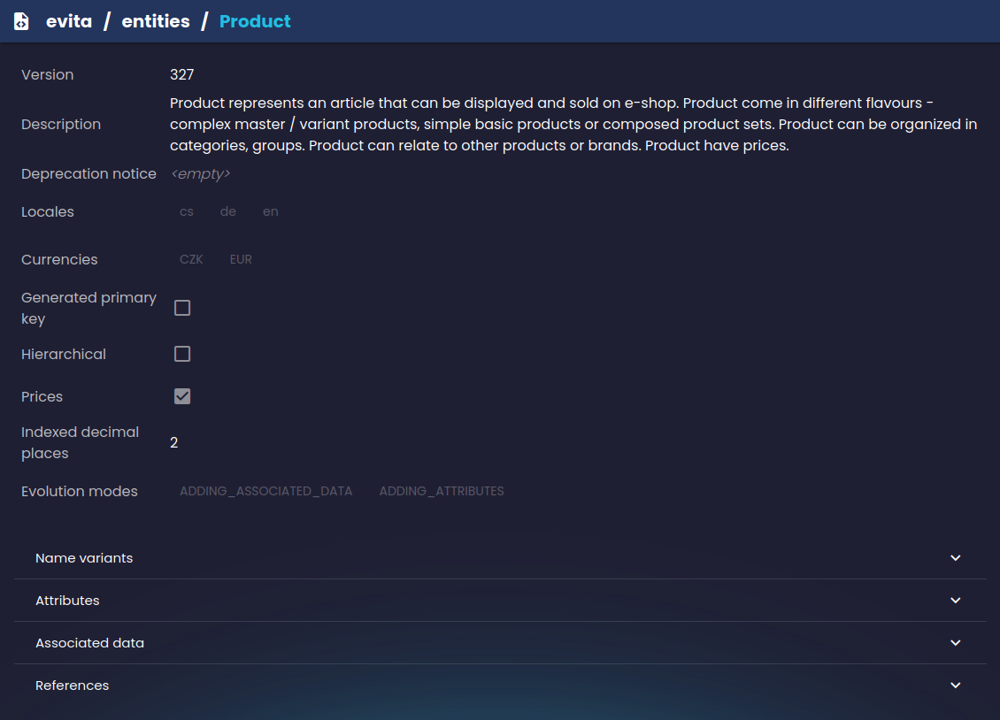
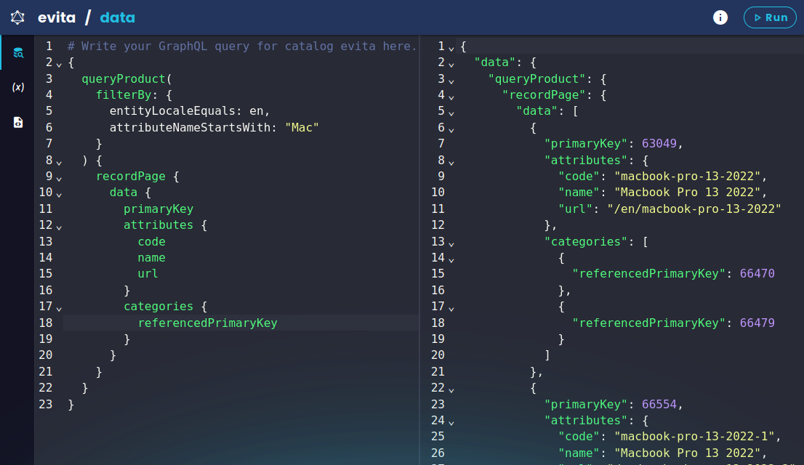
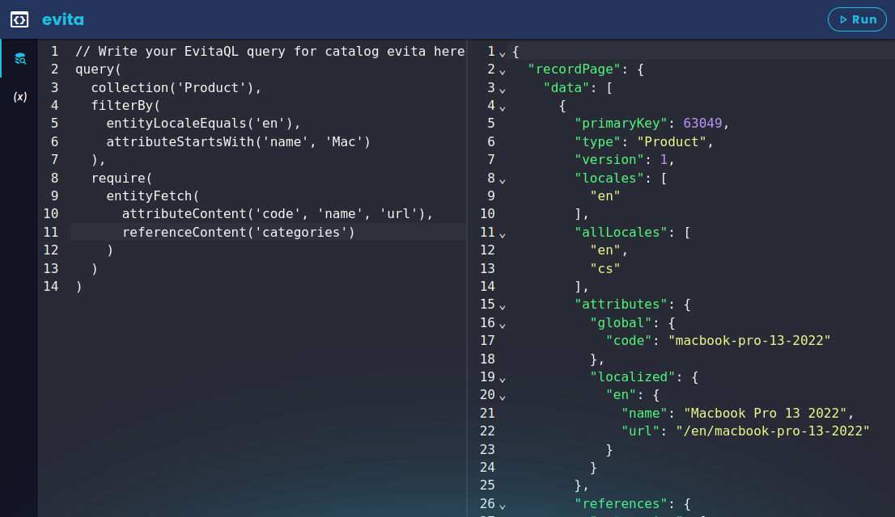
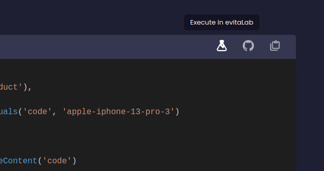

It's always a bit “painful” to troubleshoot a problem with your production data inside a database if you don't have a
handy tool to look inside easily, and instead, you have to write different kinds of queries using different tools to get
the information that you need. We feel the same way. That's why we've created a hopefully handy GUI client for evitaDB
called evitaLab, so you have a buddy when you're either just playing with evitaDB or you're already debugging production
data.

The idea behind evitaLab is simple and that is to provide a common environment for all your evitaDB instances that you
need to access and manage. Currently, the main available tools are:

- a connection manager for evitaDB instances
- data visualization without the necessity to write any queries
- “query consoles” to quickly write queries (in evitaQL, GraphQL, etc.)

All the tools are accessible with a few clicks within an evitaDB instance connection.

## Data visualization

Data visualization is one of the main features of evitaLab. It's designed to hopefully make it easier to browse through
stored data and internal data structures, because nobody wants to write tedious queries just to quickly verify some data
or configuration.

Currently, we support two main data visualization tools: data grid and schema viewer.

### Data grid

The data grid lets you browse your stored entities without writing any queries. It displays flattened entities as rows
in an interactive table just like in SQL IDEs. Of course, there are limits to what we can display in a flat structure,
but it's a great tool for debugging or just browsing entities, because you can easily see pretty printed all the data
you need in columns next to each other, or even compare multiple entities side by side.

By default, it loads the first page of all entities in a selected collection with basic entity data and representative
attributes. You can further customize it by selecting which entity data you want to see in the detailed property
selector.

Since just looking at all of the entities you have stored is usually not enough, you can use either evitaQL or GraphQL
query languages to filter the entities. You can also order entities either by simply clicking on sortable column
headers, or by manually writing an order query.

When you find the entities you are interested in, you can preview their data in detail. Clicking a cell with a value
opens the value previewer. By default, this previewer automatically tries to pretty print the value. We currently
support plain text, Markdown, JSON, XML and HTML. This means that, if the value looks like a JSON object, you will see a
code editor with a pretty-printed JSON object. If the value looks like a generic XML document, you will see a code
editor a pretty-printed XML document. We can also render HTML, that is present in the value, directly the detail window.
Other values are pretty-printed into a Markdown document based on the data type.

### Schema viewer

The schema viewer is another tool for easy browsing without writing queries. Specifically, it allows you to browse
through evitaDB schemas that represent the structure of your domain data. You can easily check descriptions, flags,
attributes, references and much more. Again, with just a few clicks.

## Query consoles

Another large part of the evitaLab features are different types of consoles. Consoles allow you to write and execute
queries in an evitaDB-supported query language.

### GraphQL console

The GraphQL console allows you to write and execute GraphQL queries against a selected evitaDB instance without having
to remember any URLs. It automatically fetches a GraphQL schema from the evitaDB instance and auto-completes your
queries with it.

Like other GraphQL editors, it supports passing variables and viewing the GraphQL schema (although the GraphQL schema is
currently quite slow unfortunately).

### evitaQL console

The evitaQL console is similar to the GraphQL console. It allows you to write and execute queries in our own query
language. Unfortunately, unlike the GraphQL console, we don't have any autocompletion support for the evitaQL language
yet.

Although, we currently support parsing the evitaQL query language from string only internally in the gRPC API, the
implementations of evitaQL in Java and C# are almost identical, so you can test Java and C# queries.

In the future, we plan to support variables and autocompletion in the same way as in the GraphQL console.

### REST console

Unfortunately, the initial version of evitaLab doesn't include any tools for evitaDB's REST APIs. Hopefully, we will
have at least some support soon.

## evitaDB connection manager

Since evitaLab is meant to be sort of an IDE for all of your evitaDB instances, it allows you to add and save
connections to remote evitaDB instances so that you can easily access them with a few clicks and access all data without
having to remember all sorts of URLs for different APis. You get pre-configured access to all of the features mentioned
above by simply configuring a connection.

In addition to user-defined connections, if the evitaLab instance you are using is served by an evitaDB instance, it can
optionally pass on pre-defined connections for you, for an even faster start. More about this in the [Running](#running) section.

Since evitaLab in its current state [is typically served by the evitaDB instance](#running) you want to access,
it may not make much sense to
be able to define your own connection, as the evitaDB instance can automatically pass itself as the connection to
evitaLab. However, this is rather a preparation for [future plans](#future-plans), when evitaLab will also available 
as a standalone client.

## evitaDB docs interactivity

We've taken advantage of the fact that evitaLab is a web application which is being hosted on the demo of evitaDB, so
we've implemented support for running example queries from the evitaDB documentation directly in evitaLab. This way you
can easily see what data an example query returns and play with it. You can read more about this in
our [older post](https://evitadb.io/blog/08-testable-documenation#examples-interactivity).

## Running

We've designed evitaLab to be easily runnable in several different scenarios for the best developer experience. You can
run evitaLab:

- by running evitaDB - each evitaDB instance contains a copy of a local evitaLab, which is exposed by default at
  the [https://your-server:5555/lab](https://your-server:5555/lab) URL
- by visiting the [evitaDB demo website](https://demo.evitadb.io), where a read-only copy of evitaLab with a demo
  dataset is available for exploration
- as a standalone evitaLab from [Docker image](https://github.com/lukashornych/evitalab#docker) (temporary solution for
  desktop client)

The first option is the easiest way to access evitaLab with your local data if you have a running local evitaDB
instance. You can even use this approach in your test environment to be able to quickly analyze evitaDB data in your
remote test environment. As mentioned above, evitaDB automatically passes a connection to itself to the served evitaLab,
so you don't need to configure anything.

## Future plans

We have many ideas in mind for the future of evitaLab. The biggest ones at the moment are: GUI for extra results in
consoles (should simulate some parts of an e-shop), and a standalone desktop application. Unfortunately, evitaLab is not
the main product in our evitaDB family, so some features may take some time to be implemented. But if you feel
confident, check out the [next section](#technical-info) and feel free to create an issue or a PR on
our [GitHub](https://github.com/lukashornych/evitalab) with any improvements. Any input is greatly appreciated, even a
small one, like fixing typos.

## Technical info

For those who want to know more about how it works under the hood, go check out
our [GitHub repository](https://github.com/lukashornych/evitalab). The whole evitaLab is
a [SPA](https://en.wikipedia.org/wiki/Single-page_application) written entirely
in [TypeScript](https://www.typescriptlang.org/) using the [Vue framework](https://vuejs.org/). On top of that, we use
the [Vuetify component framework](https://vuetifyjs.com), so we can quickly build new features for you without spending
too much time on building custom components.

### Try it yourself

If you are interested in trying out evitaLab after reading this post, you can visit
our [demo instance](https://demo.evitadb.io), [create your own instance of evitaDB](https://evitadb.io/documentation/get-started/run-evitadb)
with built-in local evitaLab or install the [Docker image](https://github.com/lukashornych/evitalab#docker) with
standalone evitaLab.

If you already have an evitaDB instance running somewhere, chances are you already have the built-in evitaLab instance
available. Check your startup logs and look for any mentions of evitaLab. But beware, you may have an older version of
evitaDB, so it is recommended to upgrade to the latest evitaDB version to get the most recent version of evitaLab as
well.
