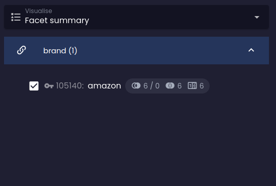

## User filter

```evitaql-syntax
userFilter(
    filterConstraint:any+
)
```

<dl> 
    <dt>filterConstraint:any+</dt>
    <dd>
        one or more mandatory filter constraints that will produce logical conjunction
    </dd>
</dl>

The <SourceClass>evita_query/src/main/java/io/evitadb/api/query/filter/UserFilter.java</SourceClass> works identically
to the [`and`](logical.md#and) constraint, but it distinguishes the filter scope, which is controlled by the user
through some kind of user interface, from the rest of the query, which contains the mandatory constraints on the result
set. The user-defined scope can be modified during certain calculations (such as the [facet](../requirements/facet.md)
or [histogram](../requirements/histogram.md) calculation), while the mandatory part outside of `userFilter` cannot.

Let's look at the example where the [`facetHaving`](references.md#facet-having) constraint is used inside
the `userFilter` container:

<SourceCodeTabs langSpecificTabOnly>

[User filter container example](/documentation/user/en/query/filtering/examples/behavioral/user-filter.evitaql)

</SourceCodeTabs>

And compare it to the situation when we remove the `userFilter` container:

| Facet summary with `facetHaving` in `userFilter`  | Facet summary without `userFilter` scope       | 
|---------------------------------------------------|------------------------------------------------|
|  |  |

As you can see in the second image, the facet summary is greatly reduced to a single facet option that is selected by
the user. Because the facet is considered a "mandatory" constraint in this case, it behaves the same as
the [`referenceHaving`](references.md#reference-having) constraint, which is combined with other constraints via logical
disjunction. Since there is no other entity that would refer to both the *amazon* brand and another brand (of course,
a product can only have a single brand), the other possible options are automatically removed from the facet summary
because they would produce an empty result set.