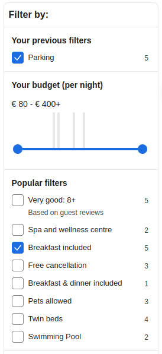
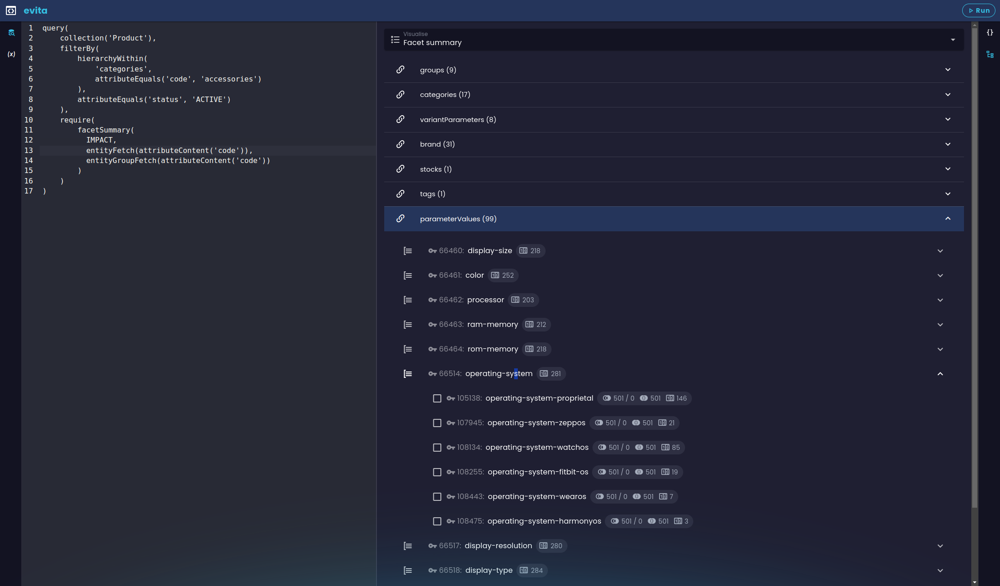

<div style="float: right">



</div>

The key success factor of faceted search is to help users to avoid situation when their filter combination returns no
results. It works the best if we gradually limit the facet options that doesn't make sense with already selected ones
and also provide accurate, in-place and real-time feedback about the number of results that will extend or limit
the current selection if other facet is selected.

Facets are usually displayed as a list of checkboxes, radio buttons, dropdowns or sliders and are organized in groups.
The options within a group usually extend current selection (logical conjunction) and the groups are usually combined
with logical disjunction. Some of the facets can be negated (logical negation) to exclude the results that match the
facet option.

Facets with high cardinality are sometimes displayed in the form of a search box or interval slider (sometime with
a [histogram](histogram.md) of the distribution of the values) to allow users to specify the exact value or range of
values they are looking for.

evitaDB supports all the above-mentioned forms of facet search using operators documented in this and 
[histogram](histogram.md) chapter.

## Facet summary

```evitaql-syntax
facetSummary(
    argument:enum(COUNTS|IMPACT),
    filterConstraint:filterBy,   
    filterConstraint:filterGroupBy,   
    orderConstraint:orderBy,   
    orderConstraint:orderGroupBy,
    requireConstraint:entityFetch,   
    requireConstraint:entityGroupFetch   
)
```

<dl>
    <dt>argument:enum(COUNTS|IMPACT)</dt>
    <dd>
        optional argument of type <SourceClass>evita_query/src/main/java/io/evitadb/api/query/require/FacetStatisticsDepth.java</SourceClass>
        that allows you to specify the computation depth of the facet summary:

        - **COUNTS**: each facet contains the number of results that match the facet option only 
        - **IMPACT**: each non-selected facet contains the prediction of the number of results that would be returned 
          if the facet option was selected (the impact analysis), this calculation is affected by the require
          constraints changing the default facet calculation behaviour: [conjunction](#facet-conjunction),
          [disjunction](#facet-disjunction), [negation](#facet-negation)
    </dd>
    <dt>filterConstraint:filterBy</dt>
    <dd>
        optional filter constraint that narrows the facets displayed and calculated in the summary to the ones that
        match the specified filter constraint
    </dd>
    <dt>filterConstraint:filterGroupBy</dt>
    <dd>
        optional filter constraint that narrows the entire facet groups whose facets are displayed and calculated in
        the summary to the ones that belong tothe facet groups matching the filtering constraint
    </dd>
    <dt>orderConstraint:orderBy</dt>
    <dd>
        optional order constraint that specifies the order of the facet options within each facet group
    </dd>
    <dt>orderConstraint:orderGroupBy</dt>
    <dd>
        optional order constraint that specifies the order of the facet groups
    </dd>
    <dd>
        optional requirement constraint that allows you to fetch the referenced entity body; the `entityFetch` 
        constraint can contain nested `referenceContent` with an additional `entityFetch` / `entityGroupFetch` 
        constraints that allows you to fetch the entities in a graph-like manner to an "infinite" depth
    </dd>
    <dt>requireConstraint:entityGroupFetch</dt>
    <dd>
        optional requirement constraint that allows you to fetch the referenced entity group body; the `entityGroupFetch` 
        constraint can contain nested `referenceContent` with an additional `entityFetch` / `entityGroupFetch` 
        constraints that allows you to fetch the entities in a graph-like manner to an "infinite" depth
    </dd>
</dl>

The requirement triggers the calculation of the <SourceClass>evita_api/src/main/java/io/evitadb/api/requestResponse/extraResult/FacetSummary.java</SourceClass>
that contains the facet summary calculation. The calculated facet summary will contain all the entity references that
are marked as `faceted` in the [entity schema](../../use/schema.md). The facet summary might be further altered by
[facet summary of reference](#facet-summary-of-reference) constraint that allows you to override the general facet
summary behaviour stated in generic facet summary require constraint.

<Note type="warning">

The `faceted` property affects the size that are held in memory of the indexes and the scope / complexity of the general
facet summary (i.e. summary generated by `facetSummary` requirement). It is recommended to mark only the references
that are used for faceted filtering as `faceted` to keep the indexes small and the facet summary calculation fast and
simple in the user interface. The combinatory complexity of the facet summary is quite high for large datasets and
you may be forced to optimize it by narrowing the summary using [filtering](#filtering-facet-summary) facility or 
selecting only [a few references](#facet-summary-of-reference) for the summary.

</Note>

### Facet summary structure

The facet summary contains only entities, that are referenced by the entities returned in the current query response and
is organized in three-tier structure:

- **[reference](#1st-tier-reference)**: the top-level contains the names of the references that are marked as `faceted` 
  in the [entity schema](../../use/schema.md)
- **[facet group](#2nd-tier-facet-group)**: the second-level contains the groups that are specified in 
  the returned [entity's references](../../use/data-model.md#references)
- **[facet](#3rd-tier-facet)**: the third-level contains the facet options that represents entities of the returned 
  [entity's references](../../use/data-model.md#references)

#### 1st tier: reference

For each entity's reference that is marked as `faceted` in the facet summary there is a separate data container 
for each [2nd tier facet groups](#2nd-tier-facet-group). If the facets for this reference are not organized in groups
(the reference lacks the group information), the facet summary will contain only one facet group called "non-grouped
facets".

#### 2nd tier: facet group

Facet group lists all the [facet options](#3rd-tier-facet) that are available for the given group and reference 
combination. It also contains `count` of all the entities in current query result that match at least one facet in the 
group / reference. Optionally it can contain the body of the group entity if the [`entityGroupFetch`](#entity-group-fetch)
requirement is specified.

#### 3rd tier: facet

Facet contains the statistics of the particular facet option:

<dl>
  <dt>count</dt>
  <dd>
    It represents the number of all the entities in current query result that match this facet (has reference to entity
    with this primary key).
  </dd>
  <dt>requested</dt>
  <dd>
    `TRUE` in case this facet is requested in [`user filter`](../filtering/behavioral.md#user-filter) container of this
    query, `FALSE` otherwise (this property allows you to easily mark the facet checkbox as "checked" in the user
    interface)
  </dd>
</dl>

And optionally the body of the facet (referenced) entity if the [`entityFetch`](#entity-fetch) requirement is specified.
When the `IMPACT` statistics depth is requested in the facet summary the statistics will also contain the `requestImpact`
calculation that contains following data:

<dl>
  <dt>matchCount</dt>
  <dd>
    It represents the number of all the entities that would match a new query derived from current query should this
    particular facet option be selected (has reference to entity with this primary key). Current query is left intact
    including the [`user filter`](../filtering/behavioral.md#user-filter) part, but a new facet request is virtually 
    added to user filter to calculate the hypothetical impact of the facet option selection.
  </dd>
  <dt>difference</dt>
  <dd>
    It represents the difference between the `matchCount` (hypothetical result should this facet be selected) and 
    the current count of returned entities. It represents the scope of the impact on the current result. Can be either
    positive (the facet option would extend the current result) or negative (the facet option would limit the current
    result). The difference might be `0` if the facet option doesn't change the current result.
  </dd>
  <dt>hasSense</dt>
  <dd>
    `TRUE` in case the facet option combined with current query still produces some results (`matchCount > 0`), `FALSE` 
    otherwise. This property allows you to easily mark the facet checkbox as "disabled" in the user interface.
  </dd>
</dl>

The facet summary is always computed as a side result of main entity query and respects all filtering constraints placed
upon the queried entities. To demonstrate the facet summary calculation we will use the following example:

<SourceCodeTabs langSpecificTabOnly>

[Facet summary calculation for products in "accessories" category](/documentation/user/en/query/requirements/examples/facet/facet-summary-simple.evitaql)

</SourceCodeTabs>

To better understand the data in the facet calculation let's extend the query a little bit and fetch additional data
using [`entityFetch`](#entity-fetch) and [`entityGroupFetch`](#entity-group-fetch) requirement. To make the example more
realistic, let's fetch for each entity the localized name in English localization:

<SourceCodeTabs langSpecificTabOnly>

[Facet summary calculation for products in "accessories" category](/documentation/user/en/query/requirements/examples/facet/facet-summary.evitaql)

</SourceCodeTabs>

If you want to get more familiar with the facet summary calculation, you can try to play with the query and see how it
affects the visualization tab you can find in our [evitaLab](https://demo.evitadb.io) console:



The visualization is organized the same as the facet summary itself:

| Icon                                                                  | Meaning                                                                                                                                                                                                         |
|-----------------------------------------------------------------------|-----------------------------------------------------------------------------------------------------------------------------------------------------------------------------------------------------------------|
|            | At the top level you see the references that are marked by chain icon.                                                                                                                                          |
|  | Under them there are groups discovered inside those reference types, which are marked with the group icon, and finally under the groups there are facet options themselves.                                     |
|                      | shows the count of the returned entities that match this facet option   if the user has no other facets selected  ( i.e. has empty  [ ` userFilter ` ] ( ../filtering/behavioral.md#user-filter )  constraint ) |
|                  | shows the current count of the returned entities that match   filtering constraints, next to slash there is a difference in the result count should this facet option be added to   the user filter             |
|                      | shows the total number of entities that will be displayed in the   result if this facet option is selected  ( i.e. the number of entities that match the facet option in the entire dataset )                   |

<Note type="info">

<NoteTitle toggles="true">

##### The result of facet summary in "accessories" category

</NoteTitle>

The query returns list of "active" products in "accessories" category and in the extra results index it also contains
the facet summary calculation:

<MDInclude sourceVariable="data.extraResults.facetSummary">[The result of facet summary in "accessories" category](/documentation/user/en/query/requirements/examples/facet/facet-summary.json.md)</MDInclude>

</Note>

### Filtering facet summary
### Ordering facet summary

## Facet summary of reference
## Entity group fetch
## Entity fetch
## Facet conjunction
## Facet disjunction
## Facet negation