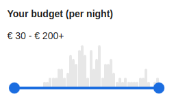

There are actually only a few use cases in e-commerce websites where histograms are used. The most common is the price
histogram, which is used to filter products by price. You can see an example of such a histogram on the Booking.com 
website:



It's a shame that the histogram isn't used more often, because it's a very useful tool for gaining insight into 
the distribution of product attributes with high cardinality values such as weight, height, width and so on.

The histogram data structure is optimized for frontend rendering. It contains the following fields:

- **`max`** - the maximum value of the attribute in the current filter context
- **`buckets`** - an array of buckets, each of which contains the following fields:
  - **`index`** - the index of the bucket in the array
  - **`threshold`** - the minimum value of the attribute in the bucket
  - **`occurences`** - the number of elements whose attribute value falls into the bucket

## Attribute histogram

```evitaql-syntax
attributeHistogram(
    argument:int!,
    argument:string+
)
```

<dl> 
    <dt>argument:int!</dt>
    <dd>
        the number of columns (buckets) in the histogram; number should be chosen so that the histogram fits well
        into the available space on the screen
    </dd>
    <dt>argument:string+</dt>
    <dd>
        one or more names of the [entity attribute](../../use/schema.md#attributes) whose values will be used to generate
        the histograms
    </dd>
</dl>

<LanguageSpecific to="java,evitaql,rest,graphql">
The <SourceClass>evita_api/src/main/java/io/evitadb/api/requestResponse/extraResult/AttributeHistogram.java</SourceClass>
</LanguageSpecific>
<LanguageSpecific to="csharp">
The <SourceClass>EvitaDB.Client/Models/ExtraResults/AttributeHistogram.cs</SourceClass>
</LanguageSpecific>
can be computed from any [filterable attribute](../../use/data-model.md#attributes-unique-filterable-sortable-localized) 
whose type is numeric. The histogram is computed only from the attributes of elements that match the current mandatory 
part of the filter. The interval related constraints - i.e. [`attributeBetween`](../filtering/comparable.md#attribute-between) 
and [`priceBetween`](../filtering/price.md#price-between) in the [`userFilter`](../filtering/behavioral.md#user-filter) 
part are excluded for the sake of histogram calculation. If this weren't the case, the user narrowing the filtered range 
based on the histogram results would be driven into a narrower and narrower range and eventually into a dead end.

To demonstrate the use of the histogram, we will use the following example:

<SourceCodeTabs langSpecificTabOnly>

[Attribute histogram over `width` and `height` attributes](/documentation/user/en/query/requirements/examples/histogram/attribute-histogram.evitaql)

</SourceCodeTabs>

The simplified result looks like this:

<MDInclude sourceVariable="extraResults.AttributeHistogram">[The result of `width` and `height` attribute histogram](/documentation/user/en/query/requirements/examples/histogram/attribute-histogram.evitaql.string.md)</MDInclude>

<Note type="info">

<NoteTitle toggles="true">

##### The result of `width` and `height` attribute histogram in JSON format

</NoteTitle>

The histogram result in JSON format is a bit more verbose, but it's still quite readable:

<MDInclude sourceVariable="extraResults.AttributeHistogram">[The result of `width` and `height` attribute histogram in JSON format](/documentation/user/en/query/requirements/examples/histogram/attribute-histogram.evitaql.json.md)</MDInclude>

</Note>

## Price histogram

```evitaql-syntax
priceHistogram(   
    argument:int!
)
```

<dl>
    <dt>argument:int!</dt>
    <dd>
        the number of columns (buckets) in the histogram; number should be chosen so that the histogram fits well
        into the available space on the screen
    </dd>
</dl>

<LanguageSpecific to="java,evitaql,rest,graphql">
The <SourceClass>evita_api/src/main/java/io/evitadb/api/requestResponse/extraResult/PriceHistogram.java</SourceClass>
</LanguageSpecific>
<LanguageSpecific to="csharp">
The <SourceClass>EvitaDB.Client/Models/ExtraResults/PriceHistogram.cs</SourceClass>
</LanguageSpecific>
is computed from the [price for sale](../filtering/price.md). The interval related constraints - i.e. 
[`attributeBetween`](../filtering/comparable.md#attribute-between) and [`priceBetween`](../filtering/price.md#price-between) 
in the [`userFilter`](../filtering/behavioral.md#user-filter) part are excluded for the sake of histogram calculation. 
If this weren't the case, the user narrowing the filtered range based on the histogram results would be driven into 
a narrower and narrower range and eventually into a dead end.

The [`priceType`](price.md#price-type) requirement the source price property for the histogram computation. If no
requirement, the histogram visualizes the price with tax.

To demonstrate the use of the histogram, we will use the following example:

<SourceCodeTabs langSpecificTabOnly>

[Price histogram](/documentation/user/en/query/requirements/examples/histogram/price-histogram.evitaql)

</SourceCodeTabs>

The simplified result looks like this:

<MDInclude sourceVariable="extraResults.PriceHistogram">[The result of price histogram](/documentation/user/en/query/requirements/examples/histogram/price-histogram.evitaql.string.md)</MDInclude>

<Note type="info">

<NoteTitle toggles="true">

##### The result of price histogram in JSON format

</NoteTitle>

The histogram result in JSON format is a bit more verbose, but it's still quite readable:

<MDInclude sourceVariable="extraResults.PriceHistogram">[The result of price histogram in JSON format](/documentation/user/en/query/requirements/examples/histogram/price-histogram.evitaql.json.md)</MDInclude>

</Note>